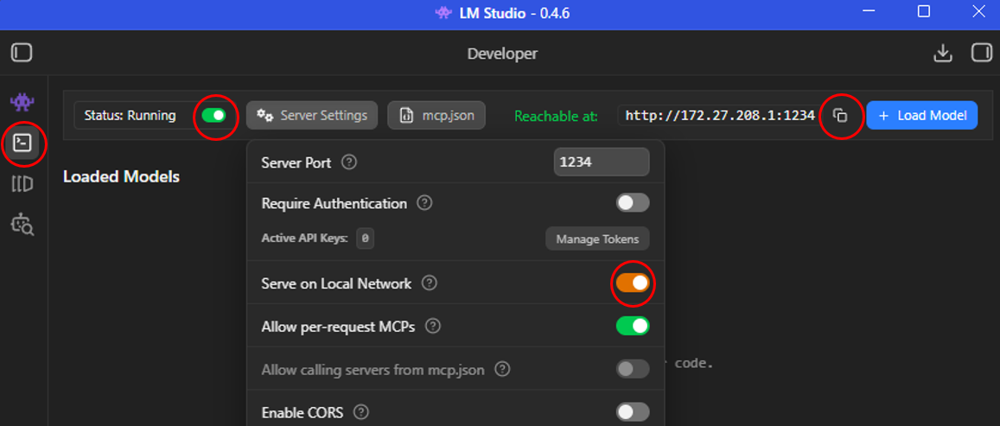
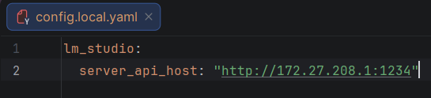

## Setup LM Sudio
LM Studio allows you to chat with a local LLM.

### A) Setup server
1. Install [LM Studio](https://lmstudio.ai/)
2. Go to the `Developer` tab in the left panel
3. Start the server
4. Server Settings => Serve on Local Network
5. Copy the server URL
6. Paste it in the `config.local.yaml` file under `lm_studio` : `server_api_host`. Use the same structure as config.yaml

### B) Install model
1. Go to `Model Search` tab in left panel
2. Search for `bartowski/Ministral-8B-Instruct-2410-GGUF`
3. Select the `Q6_K_L` quantization
4. Download the model

### C) If you want to use another model
1. Go to `config.local.yaml` and add a 3rd config like in `config.yaml`
2. Update `model` and the quantization `model_variant`
3. Where to find `model_key` => Go to `My Models` tab in left panel => Click on the 3 dots of you model => Copy Default Identifier
4. Change `config_chosen` to 3 in `config.local.yaml`

## Windows
Pros : takes 5 times less RAM than Docker.
 Cons : Speech to text takes 10 times more time than Docker.
 My personal recommendation is to use docker instead.

Authorization to run ps1 scripts :
 `Set-ExecutionPolicy -ExecutionPolicy Unrestricted`
 `Get-ExecutionPolicy` => should get `Unrestricted`

Setup environment :
 `.\bootstrap.ps1`

Run the program :
 `uv run python src/main.py`

## Linux
**⚠️ Memory Warning:** Unlike Windows, which uses a robust system memory fallback (Shared GPU Memory), Linux can be sensitive to VRAM limits. Exceeding your GPU's physical capacity often leads to Out-of-Memory (OOM) errors or crashes.

Authorization to run this bash script :
 `chmod +x bootstrap.sh`

Setup environment :
 `./bootstrap.sh`

Run the program :
 `uv run python src/main.py`

## Docker
The program saves results to a /data folder. To access these files on your host machine, you need to map a local directory using a .env file.
1. Create/Open the .env file in the root directory.
2. Define the path by updating the DATA_DIR variable to point to your desired local folder: `DATA_DIR=C:/path/to/your/docker-data`

Run the program :
 `docker compose up`